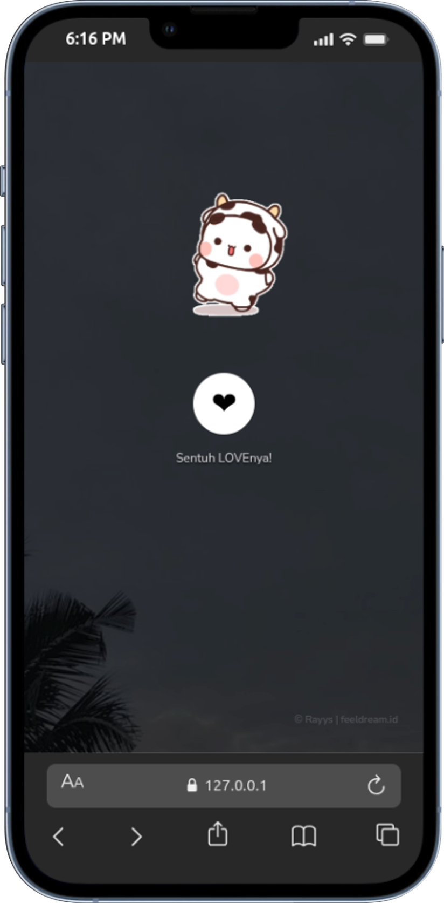

# 💌 Maaf Aku Suka Bikin Kamu Kesel

<div align="center">



**A romantic interactive web experience to express your feelings** ❤️

[](https://developer.mozilla.org/en-US/docs/Web/HTML)
[](https://developer.mozilla.org/en-US/docs/Web/CSS)
[](https://developer.mozilla.org/en-US/docs/Web/JavaScript)

</div>

---

## ✨ Features

- 🎵 **Background Music** - Romantic audio that plays automatically
- 💝 **Interactive Love Button** - Tap the heart to start the experience
- 🎨 **Beautiful Animations** - Smooth transitions and falling hearts effect
- 📱 **Responsive Design** - Works perfectly on mobile and desktop
- 🖼️ **Dynamic Wallpapers** - Multiple background images that change
- 🎭 **Cute Stickers** - Adorable GIF stickers throughout the journey
- 💬 **Sweet Messages** - Heartfelt messages displayed with typing effect
- 🎪 **SweetAlert Integration** - Beautiful popup notifications

---

## 🚀 Quick Start

### Prerequisites

- A modern web browser (Chrome, Firefox, Safari, Edge)
- Local web server (optional, but recommended)

### Installation

1. **Clone the repository**
   ```bash
   git clone <your-repo-url>
   cd bikin-kesel
   ```

2. **Open the project**
   - Simply open `index.html` in your browser, or
   - Use a local server for better experience:
   ```bash
   # Using Python
   python -m http.server 8000
   
   # Using Node.js
   npx http-server
   ```

3. **Access the application**
   - Navigate to `http://localhost:8000` in your browser

---

## 📁 Project Structure

```
bikin-kesel/
├── index.html              # Main HTML file
├── assets/
│   ├── style.css          # Styling and animations
│   ├── bikinkesal.js      # Interactive functionality
│   ├── seandainya.mp3     # Background music
│   └── images/            # Stickers and wallpapers
│       ├── pandaputih.gif
│       ├── bwa2.gif
│       ├── wortel.gif
│       ├── ngumpet.gif
│       ├── pusn.gif
│       ├── papjalan.jpeg
│       ├── papjalan2.jpeg
│       ├── papjalan3.jpeg
│       └── paplalulintas4.jpeg
├── favicon.png            # Site favicon
└── README.md             # This file
```

---

## 🎨 Customization

### Change the Message

Edit the text in `index.html` to personalize your message:

```html
<p>
  <b>
    <span>hii ayaangggg</span>
  </b>
</p>
```

### Replace Images

1. Add your images to the `assets/images/` folder
2. Update the image sources in `index.html`:
   ```html
   
   ```

### Change Background Music

Replace `assets/seandainya.mp3` with your preferred audio file, or update the source:

```html
<audio src="/assets/your-music.mp3" id="linkmp3" class="sembunyi"></audio>
```

---

## 🛠️ Technologies Used

| Technology | Purpose |
|-----------|---------|
| **HTML5** | Structure and content |
| **CSS3** | Styling and animations |
| **JavaScript** | Interactivity and logic |
| **SweetAlert2** | Beautiful alert popups |
| **TypeIt** | Typing animation effect |
| **Font Awesome** | Icon library for hearts |
| **Google Fonts** | Custom typography (Nunito Sans, Sono, Nerko One) |

---

## 💡 How It Works

1. **Initial Screen** - User sees a cute panda sticker with a LOVE button
2. **Tap the Heart** - Music starts playing and hearts begin falling
3. **Message Sequence** - Sweet messages appear one by one with typing effect
4. **Interactive Slides** - User can click through different messages and wallpapers
5. **Final Message** - A heartfelt apology and love declaration

---

## 📸 Screenshots

<div align="center">

### Opening Screen


*The initial screen with the love button*

</div>

---

## 🎯 Use Cases

- 💕 Express your feelings to someone special
- 🎁 Create a unique digital gift
- 💌 Send an apology in a creative way
- 🎉 Celebrate anniversaries or special moments
- 💝 Share your love story

---

## 🤝 Contributing

Contributions are welcome! Feel free to:

1. Fork the project
2. Create your feature branch (`git checkout -b feature/AmazingFeature`)
3. Commit your changes (`git commit -m 'Add some AmazingFeature'`)
4. Push to the branch (`git push origin feature/AmazingFeature`)
5. Open a Pull Request

---

## 📝 License

This project is open source and available for personal use. Feel free to customize it for your own romantic gestures! ❤️

---

## 👨‍💻 Credits

**Original Creator:** Rayys  
- 🌐 Blog: [feeldream.id](https://feeldream.id)  
- 📷 Instagram: [@rayyarrr](https://instagram.com/rayyarrr)  
- 🎵 TikTok: [@feelthisray](https://tiktok.com/@feelthisray)  
- 📧 Email: rayyarr73@gmail.com  

---

<div align="center">

**Made with ❤️ and lots of love**

*"maaf ya aku belum bisa jadi yang terbaik buat kamu"*

⭐ Star this repo if you found it helpful!

</div>
